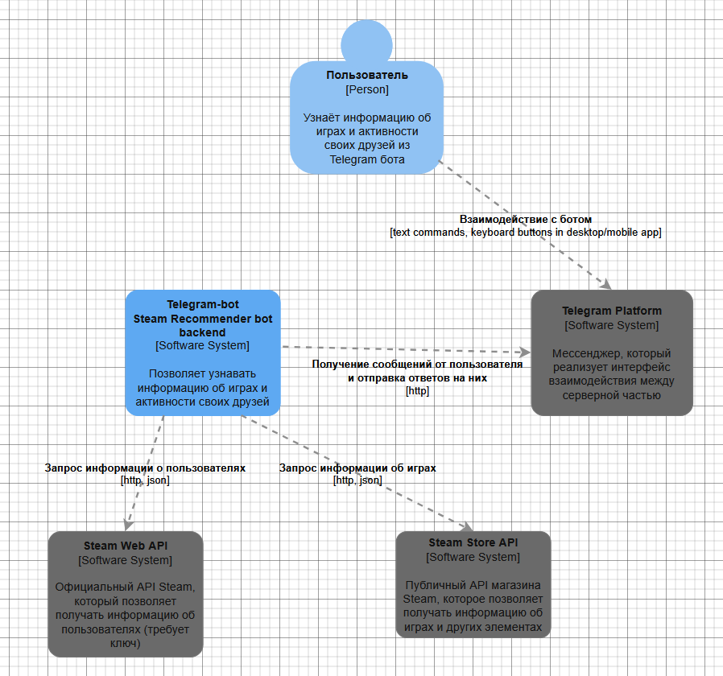
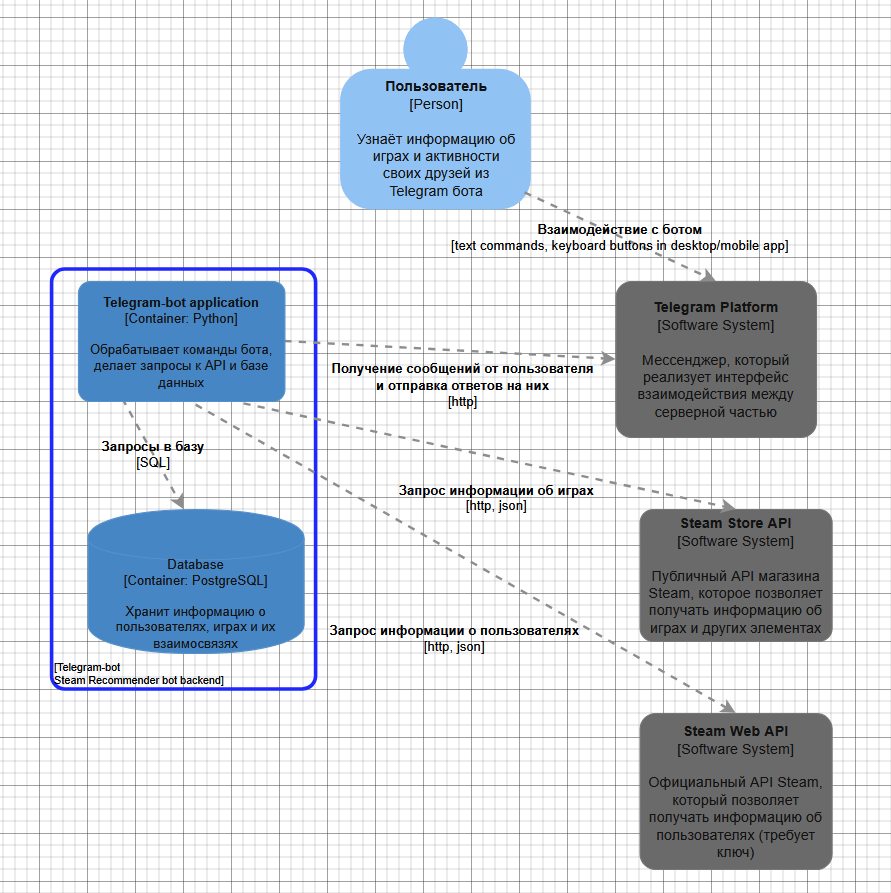

# Steam Game Recommender Bot
Telegram-бот для рекомендации игр из Steam на основе анализа пользовательских предпочтений.

Игроки Steam тратят непропорционально много времени на поиск игр, выбор во что играть и отслеживание активности друзей, вместо самого игрового процесса. Разрозненные источники информации, отсутствие персонализированных рекомендаций и сложность координации с друзьями снижают удовольствие от игрового хобби.

## Состав группы
Зайцев Владимир Алексеевич 5130904/30103

## Технологический стек
- **Backend:** Python
- **Frontend/UI:** Telegram Bot
- **База данных:** PostgreSQL
- **Внешние зависимости:** 
  - Steam Web API (данные пользователей)
  - Steam Store API (метаданные игр)

 ## Пользовательсĸие сценарии
 - Пользователь играет редко и в основном с друзьями. Когда у него появляется свободное время, он хочет быстро понять, во что играют друзья прямо сейчас, чтобы мгновенно присоединиться к ним, не тратя время на долгие обсуждения и выбор игры.
 - У пользователя большая игровая библиотека и много игрового опыта. Когда он заканчивает очередную игру, он хочет получать рекомендации следующей похожей игры, чтобы не тратить часы на поиск и чтение обзоров, а быстро погружаться в новый проект.
 - Пользователь любит следить за игровыми трендами и популярностью, но не хочет постоянно мониторить стримы и новостные сайты. Он хочет одним запросом видеть, какие игры набирают популярность прямо сейчас, чтобы быть в курсе индустрии и знать, что обсуждают в сообществе.

## Архитектура проекта

### Соотношение R/W нагрузки
Чтение: 90%
- Получение информации об играх
- Получение различных рекомендаций
- Получение информации об обновлениях друзей

Запись: 10%
- Добавление новых пользователей бота
- Добавление информации о друзьях и их играх
- Добавление новых игр

### Объёмы трафика
Поскольку информация о каждой игре и пользователе довольно небольшая и 1 пользователь как и 1 игра весят не более 1 Кб, а любой запрос не требует более 100 Кб. Если допустить
что в пик будут запросы от половины дневных пользователей (5000 и 15000 запросов), то в средний RPS=4.2, что даёт трафик порядка 400 КБ/с.

### Объёмы дисковой системы
Число игр за всё время существования steam порядка 100'000-200'000 игр (в т.ч. дополнений и других сущностей). Если учесть, что рост темпов увеличения числа игр вряд ли будет 
увеличиваться относительно текущего состояния, то можно допустить, что число игр за 5 лет увеличится не более чем на 100'000 единиц, большинство из которых - малоизвестные.
На основе этого можно предположить, что запросы пользователей будут связаны не более чем с червертью из них т.е. 25'000 единиц. Соответсвенно мы имеем порядка 150'000
сущностей игр. На каждую из них нужно не более 10КБ (всего порядка 1.5ГБ). Если учесть, что таблицы пользователей бота и дружеских отношений содержат несколько десятков байт на 
запись, а число записей имеет порядок не больший, числа игр, то информационный вес данных таблиц будет мал относительно базы игр. Если грубо оценить число пользователей бота за 
5 лет в 1'000'000 человек. Для каждого пользователя будет требоваться не более 300 байт (~300 МБ). Таким образом грубая оценка указывает на необходимость памяти порядка 2Гб. 

### Диаграмма контекста (C4 уровень 1)



### Диаграмма контекста (C4 уровень 2)



### Контракты API

Среднее время отклика API не должно превышать **1.5-2 с**. Этого достаточно для комфортного взаимодействия при общении через чат. 

* Получение списка друзей Steam: 
``` 
 GET https://api.steampowered.com/ISteamUser/GetFriendList/v1/
```

* Получение игр пользователя Steam:
```
GET https://api.steampowered.com/IPlayerService/GetOwnedGames/v1/
```

* Получение информации о пользователях Steam:
```
GET https://api.steampowered.com/ISteamUser/GetPlayerSummaries/v2/
```

* Получение информации об игре Steam:
```
GET https://store.steampowered.com/api/appdetails
```

* Получение популярных и трендовых игр:
```
GET https://store.steampowered.com/api/featuredcategories
```

### Схема базы данных 


### Масштабирование сервиса

* Для масштабирования в первую очередь будет необходим с pooling на webhook, что позволит более равномерно распределить нагрузку по времени, а также использовать несколько обработчиков запросов. Также можно использовать репликацию базы данных для ускорея обработки тяжёлых запросов рекомендательного характера к самой базе. При этом географическое распложение этих обработчиков не столь критично, так как при стабильности соединения сетевые задержки вносят довольно малый вклад во время отклика    

* Поскольку информация для каждого отдельного пользователя не будет превышать 10КБ, а рост числа игр (более тяжёлые записи) сильно ограничен, то рост потребления памяти будет меньше линейного. Соответственно вся база всё также будет требовать не более 5ГБ дискового пространства, что доступно почти на любом накопителе.   

* Рост нагрузки на сеть будет линейным и не будет превышать 50 Мб/с, которые доступны практически при любом подключении. 

## Unit тесты
Unit тесты реализованы для всех классов и функций кроме основного `TelegramBot`, функционал которого полностью на них опирается.

## Интеграционное тестирование
Интеграционное тестированое проверяет следующий сценарий:
* Пользователь вводит команду `/start` 

* Пользователь добавляет свой Steam id

* Пользователь запрашивает игры похожие на игру к которой не удаётся подобрать похожие (недостаточно статистики по ней в базе)

* Пользователь запрашивает игры похожие на игру к которой можно подобрать рекомендации

* Пользователь запрашивает информацию по игре, данных о которой ещё нет в базе

* Пользователь запрашивает информацию по игре, которая хранится в базе

## Сборĸа

Для запуска тестов достаточно выполнить 
`docker compose -f docker-compose.test.yml up --build --abort-on-container-exit`

Для запуска реального бота необходимо добавить токены бота и steam api в `params.env` и выполнить 
`docker compose -f docker-compose.yml up --build`
